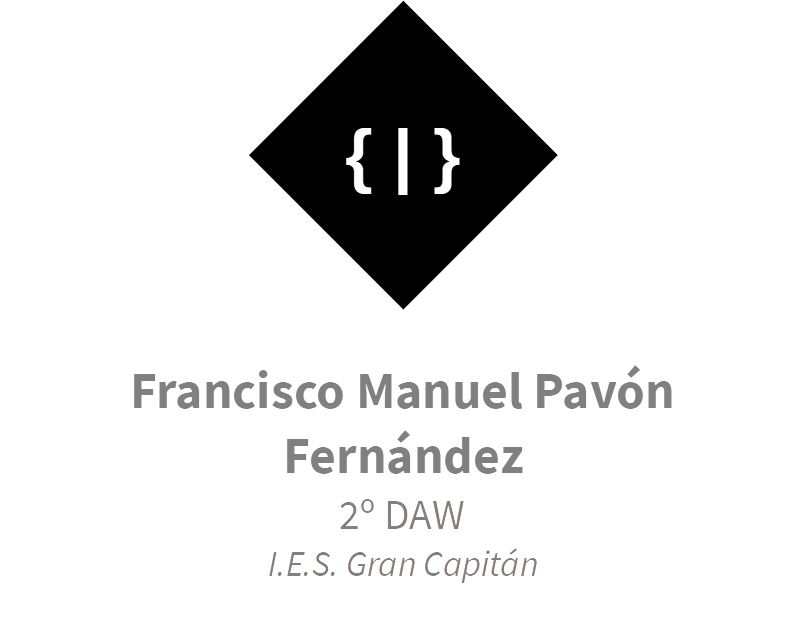

# Tarea 3.10
> Francisco Manuel Pavón Fernández

```js
const buttons = [
    ["CE",
        "⬅",
        "%",
        "+"],
    ["7",
        "8",
        "9",
        "-"],
    ["4",
        "5",
        "6",
        "x"],
    ["1",
        "2",
        "3",
        "÷"],
    ["0",
        "±",
        ".",
        "="]
];
```
Se ha declarado un array que contiene a su vez varios arrays con el texto de los botones. Cada array representa una fila.

```js
function createHTMLNode(type, attributes = [], textContent = "") {
    let element = document.createElement(type);
    attributes.forEach(attribute => {
        element.setAttribute(attribute.name, attribute.value);
    });
    element.textContent = textContent;
    return element;
}
```
La función ***`createHTMLNode(type, attributes, textContent)`*** se ha creado para facilitar la creción de nodos html.

```js
function init() {
    let div = createHTMLNode("div");
    let input = createHTMLNode("input", [
        { name: "type", value: "text" },
        { name: "value", value: "0" },
        { name: "disabled", value: "true" }
    ]);
    div.appendChild(input);
    buttons.forEach(caja => {
        let divRow = createHTMLNode("div");
        caja.forEach(boton => {
            let buttonNode = createHTMLNode("button", [], boton);
            divRow.appendChild(buttonNode);
        });
        div.appendChild(divRow);
    });
    document.body.appendChild(div);
}
```
Por último la función que se ejecuta, ***`init()`***, crea y añade al `body`: un `div` principal, un `input` para el resultado y elementos `button` recorriendo el array comentado anteriormente.

---

